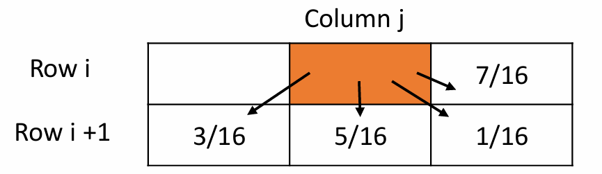
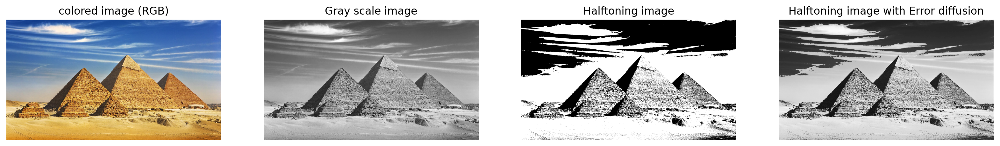
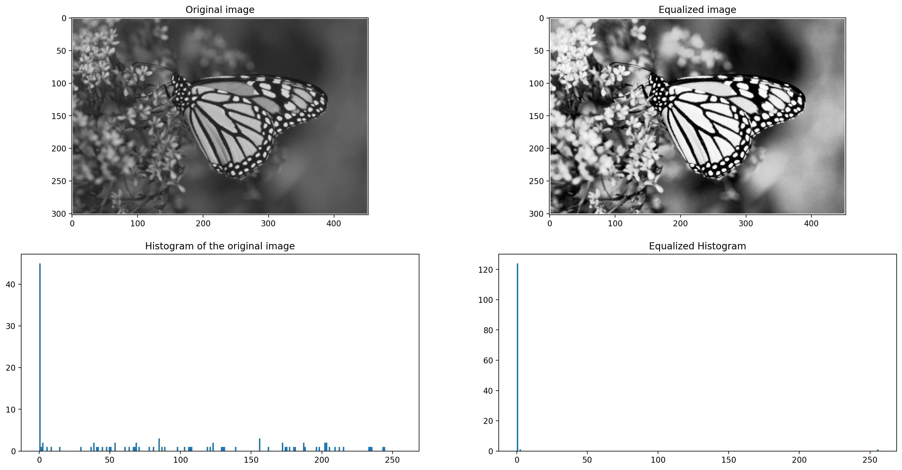
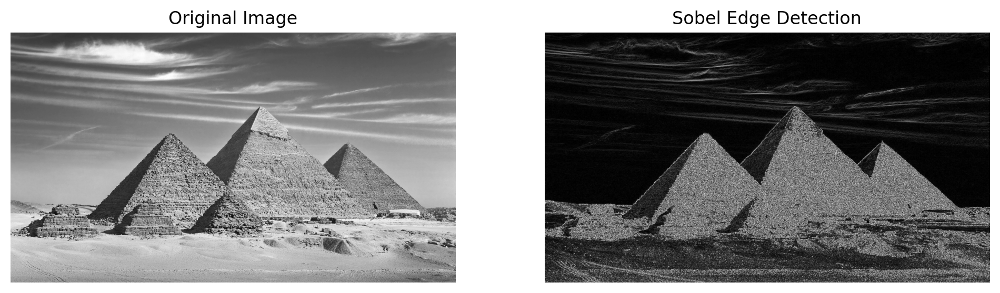

# Image_preprocessing
A series of notebooks and notes about the image processing course in Helwan university 
# RGB to gray scale 
- R 30%, G 60%, B 10%
$$
\huge I = \red{R * 0.2989} + \green{G *  0.5870} + \blue{B * 0.1140} 
$$

- **Green has the highest weight **
- **Blue has the lowest weight**
  
## other methods to convert RGB image to gray scale 
$$
\huge I = \red{R * 0.2989} + \green{G *  0.5870} + \blue{B * 0.1140} 
$$

| Method                  | Formula                                      | Description                                                                                           | Pros                           | Cons                                 |
|-------------------------|----------------------------------------------|-------------------------------------------------------------------------------------------------------|--------------------------------|--------------------------------------|
| **Luminosity Method**   | $0.2989 * R + 0.5870 * G + 0.1140 * B$       | Uses weighted average based on human perception of color brightness.                                  | More realistic grayscale       | Slightly more complex calculation    |
| **Average Method**      | $\large \frac{(R + G + B) }{3}$                            | Averages all three color channels equally.                                                            | Simple and fast                | Ignores color perception, less realistic |
| **Desaturation Method** | $\large \frac{(max(R, G, B) + min(R, G, B))} {2}$         | Averages the lightest and darkest colors in each pixel.                                               | Higher contrast                | Can lose detail                      |
| **Single Channel**      | `R` (or `G` or `B` channel)                  | Uses only one color channel as the grayscale intensity.                                               | Very simple and fast           | Ignores information from other channels |
| **ITU-R BT.601**        |$0.299 * R + 0.587 * G + 0.114 * B  $        | Similar to luminosity but defined by the ITU-R BT.601 standard, often used in video processing.       | High accuracy for video        | Slightly more complex calculation    |
```python
# function that turn the image to gray scale 
def RGB_to_gray(image):
    # we can use this but some images may have a fourth channel 
    # return np.dot(img, [0.2989, 0.5870, 0.1140])
    # but using img[..., :3] or img[:, :, :3] is taking care of this possibility 

    return np.dot(img[:, :, :3], [0.2989, 0.5870, 0.1140])
plt.imshow(RGB_to_gray(img), cmap='gray');
```

# Halftoning 
## Simple Halftoning 
```python
def halftoning_elite(img, t=128):
    if len(img.shape) > 2 : return
    # if a pixel intensity higher than t
    # assign to it 255 else 0 (white/black)
    return np.where(img >= t, 255, 0)
plt.imshow(halftoning(gimg), cmap='gray');
```
## Advanced Halftoning with Error diffusion 



```python
# original gray scale image -> gimg
# halftoned image -> himg 
# Error at given pixel is old_pixel_value - new_pixel_value 
err_diff_img = np.copy(himg)

for ir, R in enumerate(himg):
    for ic, C in enumerate(R):
        # Error = old - new
        #  THIS IS THE STANDARD WAY AS WE CACULATING-THE-ERROR-ON-THE-SAME-IMAGE-WE-WOULD-RETURN NOT ON UNCHANGED IMAGE
        err = gimg[ir, ic] - err_diff_img[ir, ic]
        # let's propagate the error 
        bot_err, bot_lef_err, bot_rig_err, rig_err = ((1/16)*err)*np.array([5, 3, 1, 7])
        try:
            # right 
            err_diff_img[ir, ic+1] += rig_err
            # bottom 
            err_diff_img[ir+1, ic] += bot_err 
            err_diff_img[ir+1, ic+1] += bot_rig_err
            err_diff_img[ir+1, ic-1] += bot_lef_err
        except:
            continue
# Clip values to stay within valid range [0, 255]
err_diff_img = np.clip(err_diff_img, 0, 255)

plt.imshow(err_diff_img, cmap='gray')
plt.axis('off')
plt.show()
```
with padding to simplify the code 
```python 
# optimized but more simple way is to just add padding 
err_diff_img = np.copy(himg)
# padding
err_diff_img_pad = np.pad(err_diff_img, pad_width=1, constant_values=0)
for ir in range(err_diff_img.shape[0]):
    for ic in range(err_diff_img.shape[1]):
        err = gimg[ir, ic] - err_diff_img_pad[ir, ic]
        err_diff_img_pad[ir, ic+1] += err*(7/16)
        err_diff_img_pad[ir+1, ic] += err*(5/16)
        err_diff_img_pad[ir+1, ic-1] += err*(3/16)
        err_diff_img_pad[ir+1, ic+1] += err*(1/16)

un_padded_img = err_diff_img_pad[1:-1, 1:-1]
un_padded_img = np.clip(un_padded_img, 0, 255)
plt.imshow(un_padded_img, cmap='gray')
plt.axis('off')
plt.show()

```


# Histogram 

- Information contained in the graph is a representation of pixel distribution as a function of tonal variation
- A histogram uses a bar graph to profile the occurrences of each gray level present in an image.
- The horizontal axis is the gray-level values.
- It begins at zero and goes to the number of gray levels (256 in this example).
- Each vertical bar represents the number of times the corresponding gray level occurred in the image.
- Histograms also help select thresholds for object detection
  - Objects in an image tend to have similar gray levels.
  
# Histogram Equalization

- Histogram equalization is a method in image processing of contrast adjustment using the image's histogram.
- This method usually increases the global contrast of many images, especially when the image is represented by a narrow range of intensity values.
- Through this adjustment, the intensities can be better distributed on the histogram utilizing the full range of intensities evenly. 
- This allows for areas of lower local contrast to gain a higher contrast.
- Histogram equalization accomplishes this by effectively spreading out the highly populated intensity values which are used to degrade image contrast.
- It is a Straightforward technique adaptive to the input image and an invertible operator.
  - if the histogram equalization function is known, then the original histogram can be recovered.
- The method is indiscriminate
  - It may increase the contrast of background noise
  - while decreasing the usable signal.
- Histogram equalization will work the best when applied to images with much higher color depth than palette size, like continuous data or 16-bit gray-scale images.


## Equalization Algorithm 
1. Calculate the histogram of the image 
   - histogram is just the frequency/count of each pixel values in the image.
   - if the image has $N×M$ pixels.
   - for each pixel we would calculate the number of occurence $n_i$ which is the histogram $H(i)$
   - the probability of each intensity value $i$ in the image is $p(i)$ 
   $$
   \huge p(i) = \frac{n_i}{Area} = \frac{H(i)}{N×M} 
   $$
2. Compute the cumulative distribution function (CDF)
   - The CDF is used to map the original intensities to the new, equalized intensities.
   - compute the cumulative sum for each intensity level $i$
   $$
   \huge C(i) = \sum_{j=0}^{i} p(j)
   $$
   - $C(i)$ gives the cumulative probability up to intensity $i$.
   - This step effectively "spreads" the intensity values over the whole range.
   - $C(i)$ ranges from 0 and 1.
3. Map Each Pixel to the New Intensity Value
   - Using the CDF, we can map each original intensity value to a new one that distributes the pixel intensities more evenly across the histogram.
   - multiply each $C(i)$ by the maximum intensity value (255 for 8-bit images)
   $$

   \huge new-intensity(i) = int(255*C(i))
   $$


# Edges
>Edge: defined as curves in a digital image at which the image brightness changes sharply or, more formally, has discontinuities.

- The edges of items in an image hold much of the information in the image
  - location of items
  - their sizes
  - their shapes 
  - texture 
- An edge is where the gray level of the image moves from an area of low values to high values or vice versa. 
- The detected edge is the derivative of the edge, This means it is the slope or rate of change of the gray levels in the edge.
- The slope of the edge is always positive or zero.
- In the ideal case, the result of applying an edge detector to an image may lead to a set of connected curves that indicate the boundaries of objects.
- Applying an edge detection algorithm to an image may significantly reduce the amount of data to be processed.
  - filter out information that may be regarded as less relevant.
  - preserving the important structural properties of an image
- terms and notes: 
- **Mask**: The specific matrix used to detect edges.
- **Operator**: The complete edge-detection method, including all masks and any additional steps (like calculating gradient magnitude).
- **Variation in Values**: Small variations in Sobel mask values are typically due to normalization, scaling, or implementation differences but do not change the fundamental purpose of the Sobel operator.
- What is a Mask?
  - Masksthat aims to amplify the slope of the edge.
  - The Kirsch, Prewitt, and Sobel masks are **compass gradient** or **directional edge detectors**.
    - Each of the **eight masks** detects (variations of each mask) an edge in one direction.   
    - The directional edge detectors can detect an edge in only one of the eight directions.
  - There are two basic principles for each edge detector mask
    - <span style="color:red">**Numbers in the mask must sum to Zero.**</span>
      - So convolving a constant area of pixels that have same values (e.g. all are ones) the gradient would be zero.
      - As there is no change in brightness.
    - <span style="color:red">**The mask should approximate differentiation or amplify the slope of the edge.**</span>
  
## Edge detection with gradient operators

### Categories of Edge Detection Operators
1. Gradient-Based Operators
  >A **gradient operator** in computer science refers to a weighted convolution operator used to compute the gradient of an image
2. Second-Order Derivative Operators
   - Use the second derivative (e.g., Laplacian) to detect changes in the gradient, focusing on areas of rapid transition.
3. Directional Edge Detection Operators
   - Detect edges in specific directions, allowing for more control over edge orientation.
  
| **Operator**   | **Type**                   | **Kernel Size** | **Directions**       | **Noise Sensitivity** | **Edge Thickness** | **Best Use Case**                          |
|----------------|----------------------------|-----------------|----------------------|------------------------|--------------------|--------------------------------------------|
| **Sobel**      | Gradient-based             | 3x3             | Horizontal, Vertical | Moderate               | Slightly thick     | General-purpose edge detection             |
| **Prewitt**    | Gradient-based             | 3x3             | Horizontal, Vertical | High                   | Slightly thick     | Simple, fast edge detection                |
| **Kirsch**     | Directional gradient-based | 3x3             | 8 directions         | High                   | Thick              | Directional edge detection                 |
| **Laplacian**  | Second-order derivative    | 3x3 or larger   | All directions       | Very high              | Thin               | Detecting fine details                     |
| **Canny**      | Multi-stage gradient-based | Multiple steps  | All directions       | Low                    | Thin               | Precise edge detection with noise reduction |
| **Roberts**    | Gradient-based             | 2x2             | Diagonal             | Very high              | Thin               | Fine detail detection                      |


- Edge detection $\rarr$ is edge differentiation
  - Image gradient  
    - we know that digital image 🖼️ is a discrete 2D functions where at each pixel value we got the intensity. 
    - And an edge is a sudden change in intensity. 
    - Edge would be in the pixel level so we need to calculate the differentiation or the gradient of an image in some local areas of this discerete 2D function.
    - The derivative of a function $f(x)$ with respect to $x$ is the limit difference in $f(x)$ values as **two points get infinitely close.**
    $$
    \huge f'(x) = \lim_{\red{\Delta x \rarr 0}} \frac{f(x+\red{\Delta x}) - f(x)}{\red{\Delta x}}
    $$
    - However, in image processing, we’re dealing with discrete data—pixel intensities at specific locations.
    - We don’t have the luxury of an "infinitely small" change in $x$ or $y$.
    - Instead, we approximate this change using a <span style="color:red">**finite difference**</span>, calculating how the intensity values change between adjacent pixels.
    - In 1D <span style="color:red">**finite difference approximation**</span> to the derivative at a point $x$ can be given by:
    $$
    \huge f'(x) ≈  \frac{f(x+\red{h}) - f(x)}{\red{h}}
    $$
    - where $h$ is a small distance (often just 1 pixel in images).
    - for 2D functions (images)
    - we are interesting in the rate change in both $x$ (horizontal) and $y$ (vertical) directions (partial derivatives).
    $$
    \huge ∇f(\green x,\blue y) = [\frac{\partial f}{\partial \green x}, \frac{\partial f}{\partial \blue y}] 
    $$
    - Finite Differences for 2D Gradients
    1. Partial erivative with respect to $x$ horizontal change (h=1, one pixel).
      $$
      \huge \frac{\partial f}{\partial \green x} ≈ \frac{f(x+\red{h}, y) - f(x,y)}{\red{h}} = f(x+\red{1}, y) - f(x,y)
      $$
    2. Partial erivative with respect to $y$ horizontal change (h=1, one pixel).
      $$
      \huge \frac{\partial f}{\partial \green y} ≈ \frac{f(x, y+\red{h}) - f(x,y)}{\red{h}} = f(x, y+\red{1}) - f(x,y)
      $$
  - So simply to calculate the change in one direction, we take the difference between the pixels in that directions.
    - Because we are just approximating the gradient at that direction.
    - That is why **gradient operators need a mask for each direction**.
  - We can know the gradient magnitude after finding both partial derivatives.
    - gradient magnitude is jus the second norm of the $∇f(\green x,\blue y)$
    $$
    \huge G(\green x,\blue y) = \sqrt{(\frac{\partial f}{\partial \green x})^2+(\frac{\partial f}{\partial \blue y})^2}
    $$
    - And the oriantation (angle) 
    $$
    \huge \tan^{-1}(\frac{\frac{\partial f}{\partial \green x}}{\frac{\partial f}{\partial \blue y}})
    $$
  - Thoses differences can be gathered in a mask and use that mask to convolve an image.

#### Sobel
- The operator uses two `3×3` kernels which are convolved with the original image to calculate approximations of the derivatives.
  - one for horizontal changes, and one for vertical.
- If we define $A$ as the source image, and $G_x$ and $G_y$ are two images which at each point contain the horizontal and vertical derivative approximations respectively.
$$
\huge G_x = 
\begin{pmatrix} 
+1 & 0 & -1 \\
+2 & 0 & -2 \\
+1 & 0 & -1 \\
\end{pmatrix} * A

$$
$$
\huge G_y = 
\begin{pmatrix} 
+1 & +2 & +1 \\
0 & 0 & 0 \\
-1 & -2 & -1 \\
\end{pmatrix} * A

$$
$$
\huge
G = \sqrt{G_x^2 + G_y^2}
$$
$$
\huge
\theta = \tan^{-1} (\frac{G_y}{G_x})
$$
- There are shapes of the sobel kerenl but all of them have three 0s in the same line, and of course elments sum to zero.
- The Sobel operator consists of two separable operations
- Smoothing perpendicular to the derivative direction with a triangle filter 
  - $h(-1)=1, h(0)=2, h(1)=1$ (plot to imagine)
- Simple central difference in the derivative direction
  - $h'(-1)=0, h'(0)=0, h'(1)=-1$



